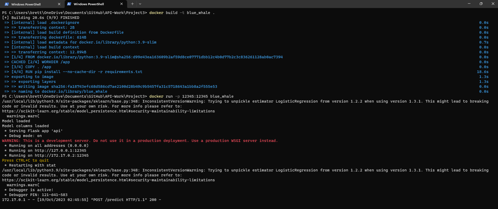
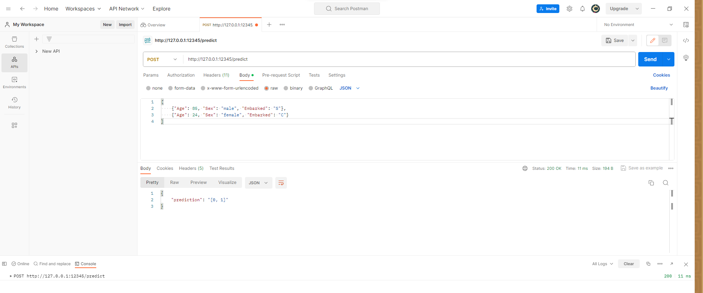
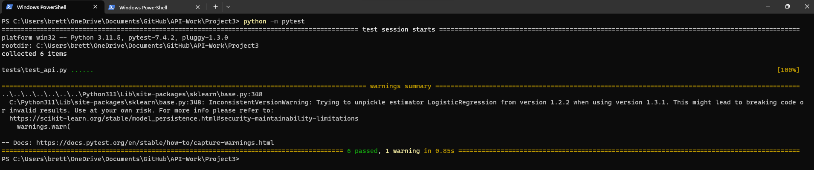

# Project 3

## Project descriptioin
This is an iteration of the first and second project. The key difference being that this version has software testing with it. The same backend applies from the first project. And the same containerization applies from the second project. 

## How to run the container
To get this project to run, execute this command:

`docker run -p 12345:12345 blue_whale`

If you would like to make changes and rebuild the image, then try this:

`docker build -t blue_whale .`

then, 

`docker run -p 12345:12345 blue_whale`

Here is what a successful build and run may look like:

## Example of running

This is the same method used in Project1 to make sure everything was setup correctly. The steps as the same as Project1, except the port number is different this time. 

After this you will be able to access the API. For this example I used [Postman](https://www.postman.com/) and sent this information: 

[
    {"Age": 85, "Sex": "male", "Embarked": "S"},
    {"Age": 24, "Sex": "female", "Embarked": "C"}
]

This is what it returned to me: 

## Example of running tests

### api.py
There are multiple tests configured to run for the api.py file. These are stored in the test directory in the test_api.py file. The testing library used for this project was PyTest and it performed the following tests:
* Prediction
* Input validation
* Endpoint availability
* Null payload
* Loading model

If you want to run the testing, execute this command:

`python -m pytest`

And if successful you should be met with a screen like this:

### model.py

still todo