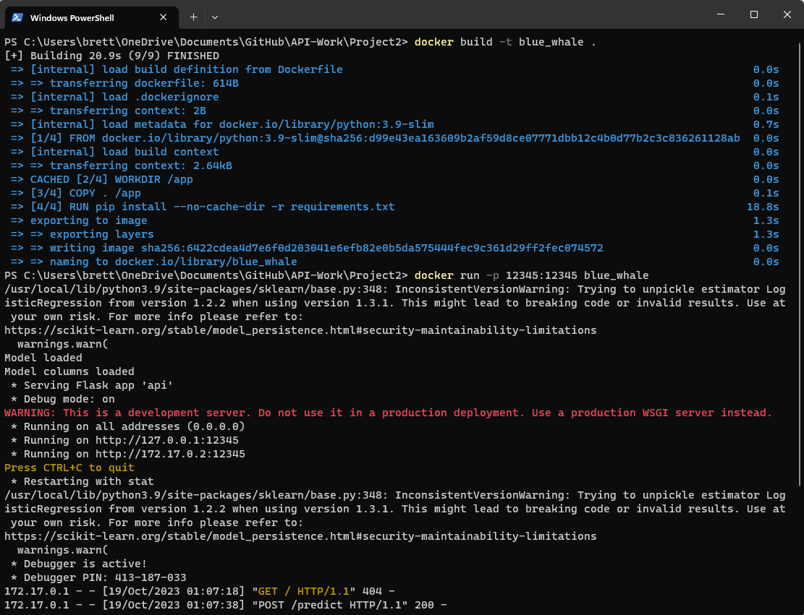
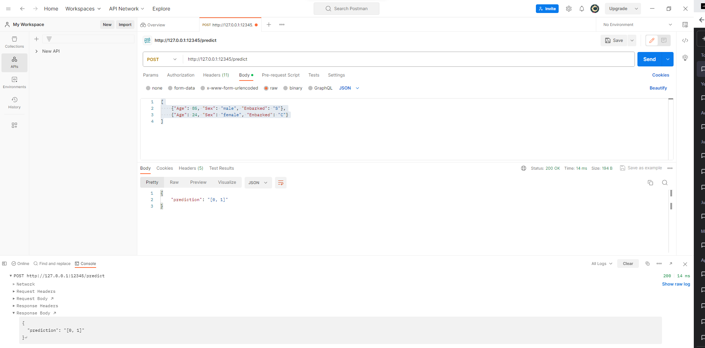

# API-Work
This repo includes some random code bits that I found helpful during some online training. This project is inspired by a [DataCamp tutorial](https://www.datacamp.com/tutorial/machine-learning-models-api-python) that I was recently looking at. The heart of the code comes from the tutorial.

## Table of Contents
* How to run
* Example of running
* Project 1 - ML with exposed API
* Project 2 - Containerized
* Project 3 - Software testing
* Project 4 - Expanded logging
* Project 5 - Performance metrics
* Project 6 - Converting Flask to FastAPI
* Project 7 - Modular code
* Project 8 - Expand test coverage
* Project 9 - Kubernetes? Helm?
* Project 10 - Frontend
* Licensing 

## How to run
To get this project to run, execute these commands:

`docker build -t blue_whale .`

then, 

`docker run -p 12345:12345 blue_whale`

Here is what a successful build and run may look like:

## Example of running

This is the same method used in Project1 to make sure everything was setup correctly. The steps as the same as Project1, except the port number is different this time. 

After this you will be able to access the API. For this example I used [Postman](https://www.postman.com/) and sent this information: 

[
    {"Age": 85, "Sex": "male", "Embarked": "S"},
    {"Age": 24, "Sex": "female", "Embarked": "C"}
]

This is what it returned to me: 

### Project 1 - ML with exposed API
The first project is the one all future iterations will be based off of. There is a machine learning model based off of the [Titanic dataset](https://www.kaggle.com/competitions/titanic) that is being served via a Flask API. 

### Project 2 - Containerized
The second project has the same components as the first project, but has been containerized using Docker. Now this can be run as a service.

### Project 3 - Software testing
The third project builds off the first two projects, but adds in software testing. Specifically using the PyTest library, several different styles of tests are run on the api.py and model.py files. 

### Project 4 - Expanded logging
The fourth project expands logging capability. This will be paramount to gauge how much the changes effect performance. 

### Project 5 - Performance metrics
The fifth project starts to identify key performance indicators (KPIs) for the project. An automated report is generated so that future changes can be weighed against something. 

### Project 6 - Converting Flask to FastAPI
The sixth project converts the Flask component to FastAPI. The benefits of FastAPI have been well-documented, but I want to see how it compares given our new KPIs. 

### Project 7 - Modular code
The seventh project refactors the code to be more modular. This needed to be done to increase reusability of code. 

### Project 8 - Expand test coverage
The eighth project expands the testing coverage. It has been a while since new software testing was addeded to the project and a lot of code has been added since then. 

### Project 9 - Kubernetes? Helm?
The ninth project adds Kubernetes? Helm? support. This is due to the size of the project. As files continue to get added, it is getting more tedious to track everything. 

### Project 10 - Frontend
The tenth project finally adds in a frontend. Yay! 

### Licensing 

MIT License

Copyright (c) [2023] [Brett Waugh]

Permission is hereby granted, free of charge, to any person obtaining a copy
of this software and associated documentation files (the "Software"), to deal
in the Software without restriction, including without limitation the rights
to use, copy, modify, merge, publish, distribute, sublicense, and/or sell
copies of the Software, and to permit persons to whom the Software is
furnished to do so, subject to the following conditions:

The above copyright notice and this permission notice shall be included in all
copies or substantial portions of the Software.

THE SOFTWARE IS PROVIDED "AS IS", WITHOUT WARRANTY OF ANY KIND, EXPRESS OR
IMPLIED, INCLUDING BUT NOT LIMITED TO THE WARRANTIES OF MERCHANTABILITY,
FITNESS FOR A PARTICULAR PURPOSE AND NONINFRINGEMENT. IN NO EVENT SHALL THE
AUTHORS OR COPYRIGHT HOLDERS BE LIABLE FOR ANY CLAIM, DAMAGES OR OTHER
LIABILITY, WHETHER IN AN ACTION OF CONTRACT, TORT OR OTHERWISE, ARISING FROM,
OUT OF OR IN CONNECTION WITH THE SOFTWARE OR THE USE OR OTHER DEALINGS IN THE
SOFTWARE.